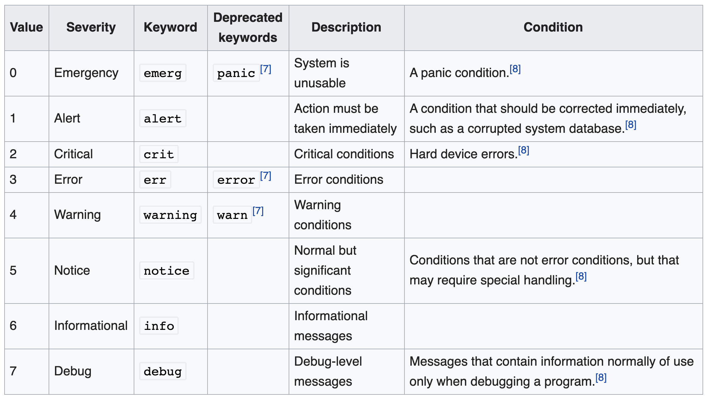
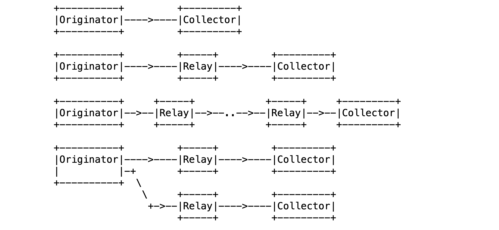
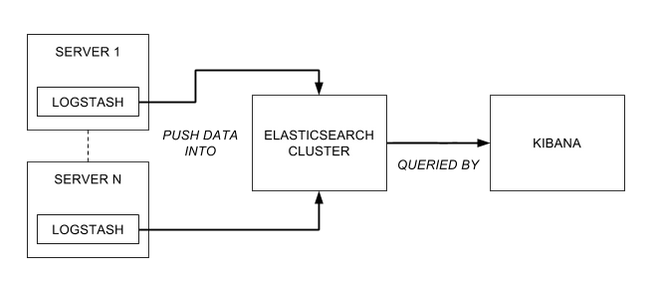
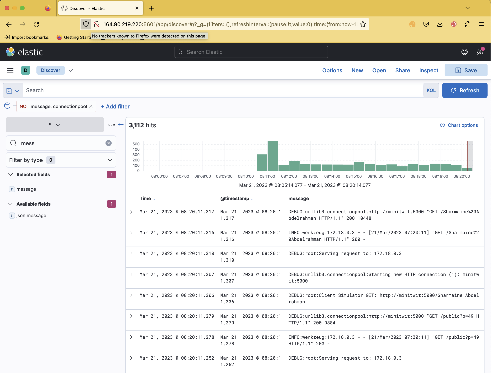
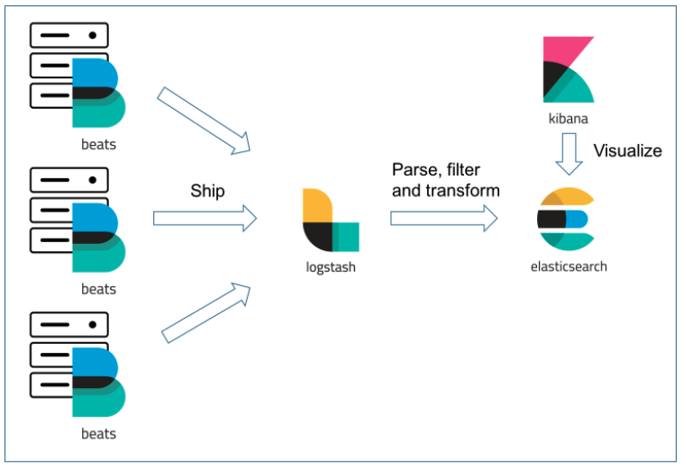
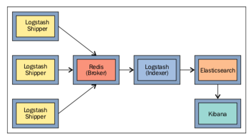
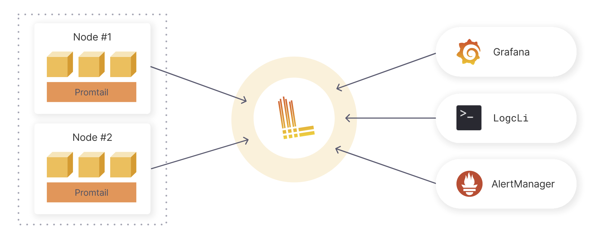
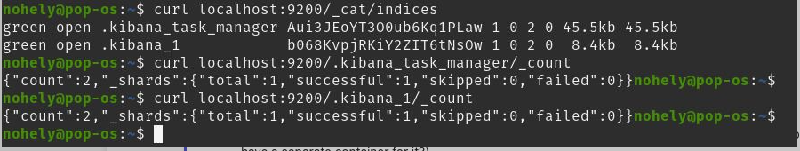

# Logging

Mircea Lungu (`mlun@itu.dk`)  

[IT University of Copenhagen, Denmark](https://www.itu.dk)

Lecture notes for: DevOps, Software Evolution and Software Maintenance 

([*pdf version of this doc*](./Logging.pdf))


--- 


*In the last episode...* 

**Monitoring** - a tool that allows you to detect problems.
- What are the types of problems detectable by monitoring? 
- Does monitoring help you understand why these problems occur? 


--- 


## From Monitoring to Logging


Monitoring does not explain *WHY* there was a problem

For the **WHY** there are other tools

- **Logging** (*main topic of today*) = understanding general kinds of problems 

- **Profiling** = understanding *performance* problems

- **Tracing** (*not today*) = understanding problems where the *sequence in which requests propagate* through distributed systems matter 


## What is it? 

**Logging** =  the **activity** of **collecting** data generated by applications, infrastructure, and other components of a system, data that will be later used for analysis. 


**Logs** =
- **streams** of 
- **aggregated**
- **time-ordered** events
- collected from **all running processes and backing services**

In server-based environments logs are commonly written to *a **logfile*** on disk. E.g., 

     cat /var/log/auth.log

or, on more modern machines:

> `sudo journalctl -u ssh --since='1 day ago'`


*Running the above command on an Internet-facing server should be a reminder of the importance of security ;)*


## Why do it?

There are three main reasons for logging: 

1. **Diagnosis** 

  - Why could the user not login yesterday? 
  - Why is the service slow?


2. **Understanding** 

 - How is our system being used?
 - Was our server under attack last night?


3. **Audit trails**
  - Sometimes logs are legally required (e.g. banking)
  - Sometimes they save your business (e.g. your DB model was not updated - but you can still recover info from the logs)


## Challenges

There are three main challenges

### 1. Scalability
Logs can quickly become very large and searching information in them can become tedious and difficult
- e.g. trying to log all function calls in your app domain will easily result in GB of data in a few seconds if you don't do it smartly
### 2. Format Incompatibility
Complex systems can generate logs in different formats 
 
E.g. look at the following files in `/var/log`: `auth.log`, `apache2/error.log`, `nginx/access.log`. Do they use the same format?

### 3. Storage Management 
 
Logging can result in very large data that has to be managed.
 
###### Story: How to not be able to login to your sever anymore
The situation resulted from the following sequence of unfortunate events
- Logfile grows to multi-GB size in a few months
 - Disk becomes full
 - To the point of not even being able to ssh into bash 
 
 Solution? *Delete files on the server without opening a terminal*


# Practical Principles

There are four main practical principles that you should apply when adding logging to your system. 

## 1. A process should not worry about storage

Or, **don't hardcode the path to the logfile to which your process writes**.

Instead, each process should **write to its unbuffered stdout stream**.

Advantage is adaptability

* **In development**: the developer looks at the terminal

* **In deployment**: output from process is routed where needed 

* Different contexts result in different logfiles, e.g. logs from cronjobs, or tool runs, go to different sinks than the main API


## 2. A process should **log only what is necessary**

What's necessary is in the eye of the beholder. E.g. each of the following, has different necessities from the logs

- Apache
- Credit Suisse
- MiniTwit


This way you **avoid ...** 

1. **duplicated information**
	* e.g., you don't need log the web server accesses; they're already logged by your web server

2. **information overload** on the reader of the logs

3. wasted disk space


## 3. Use log levels

Why? 

- Allows the user to control the amount of logging (one can easily increase log level if they want to analyze more)
* Intention revealing enables the reader to make sense of the messages


Possible intention revealing classification of log levels in Python with the `logging` package: 

```python
import sys
import logging

logging.basicConfig(
        format="%(asctime)-15sZ %(levelname)s [%(module)s] %(message)s",
        datefmt="%Y-%m-%d %H:%M:%S.%f",
        level=logging.INFO,
        stream=sys.stdout
)

logging.debug("Got here!")
logging.info("User updated preferences.")
logging.warning("Could not retrieve any items from feed.")
logging.error("Google Translate API not answering")
logging.critical("Out of memory")
```

###### Personal Story: The Python library with very verbose logs!
I remember I was reusing this Python library that would generate a LOT of logs by default, so my own logs were drowning in their's. It is good that the logging package in Python allows one to turn off logging on a per package basis!


## 4. Logs  should be centralized

Why? 

Having all the information in one place ... 

- is **more efficient** than having to search through different files on different machines
- enables **correlation analysis**


# Architectures 

## Syslog 

Protocol

* Developed in 80s
* Standardizes **formatting** and **transmission** of logs in a **network** ([RFC 3164 (2001)](https://tools.ietf.org/html/rfc3164) [RFC 5424 (2009)](https://tools.ietf.org/html/rfc5424))
* Popular in Linux
* General - for any system exchanging logs 


### Formatting

A syslog message is structured in a pre-defined format. Most essential elements are timestamp, application, level, and message. 


### Facility Codes

The original protocol defines many facility codes, several examples of which are below. 

0. kern  = Kernel messages
1. **user = user-level messages**
2. mail = mail system
3. ... [etc.](https://www.geeksforgeeks.org/what-is-syslog-server-and-its-working/)

Most of your applications will use the user facility. 


### Log Levels

Syslog predefines 8 levels of severity for logs, presented in the table below.
Other systems use only a subset of these (e.g. the `logging` package in Python).




### Architectures for Log Transmission

Syslog proposes a separation between the following roles 

  - **Originator** = sender
  - **Collector** = responsible for gathering, receiving, and storing log messages
  - **Relay** = responsible with receiving syslog messages from multiple sources, possibly aggregating them or filtering them, and then forwarding them to one or more destinations



Source: [RFC 5424 (2009)](https://tools.ietf.org/html/rfc5424)

Example of syslog configuration:
```
cat /etc/rsyslog.conf
```


## ELK

One of the most popular solutions . 

Acronym for

* **ElasticSearch** = Scalable full text search DB
* **Logstash** = Java-based log parser
* **Kibana** = Visualization tool tailored for ElasticSearch





### ElasticSearch

Distributed database which

* Provides *almost* real time full text search
* Implemented as a swarm of ElasticSearch processes where each ES process is indexing documents based on Apache Lucene
* Supports **dedicated log indexes**

*Story*: That time in 2022, when we evaluated the performance of [MySQL 8.0 Full Text Search](https://dev.mysql.com/doc/refman/8.0/en/fulltext-search.html) vs. ElasticSearch. It was not even funny.


### Logstash

Java-based **log parser** which ... 

- Converts from various **log line formats** to JSON
- ***Tails*** log files and emits events when a new log message is added
- Uses a pattern parsing plugin named Grok

An example configuration for logstash when trying to run it on my mac os looks like below: 

    input {
    	file {
    		path => "/Users/mircea/local/zeeguu/web.log"
    	}
    }

    filter {
    	grok {
    		match => { "message" => "%{TIMESTAMP_ISO8601:timestamp} %{DATA:level} %{DATA:process} %{GREEDYDATA:log}" }
    	}
        date {
            match => [ "timestamp" , "dd/MMM/yyyy:HH:mm:ss Z" ]
        }
    }

    output {
    	elasticsearch {
    		host => "elasticsearch:9200"
    		user => "elastic"
    		password => "changeme"
    	    index => "zeeguu_web_logs"
    	}
    }


Challenges

- **Resource hungry**
- Not easy to configure and troubleshoot


### Kibana

Visualization tool tailored for ElasticSearch
- Has its own query language: KQL




## Variations and Alternatives to ELK

There are many **variations** where one component in ELK is replaced with another or new components are introduced. 


### EFLK: Filebeat for shipping logs

Filebeat = *Log Shipper*

- Addresses resource consumption of logstash
- Lightweight agents on different machines send logs to logstash
- Has special plugin for *docker* -- see your exercises for an example





### EFK: Dropping Logstash Alltogether

- Filebeat sends data straight to ElasticSearch 

- If you don't need to parse further the `@message` field

- Used in your exercises example


### FRELK: With the Redis message broker

Redis = in memory data structure that can be used as DB, cache, and message broker

Purpose: prevention of data loss. Can you explain how?




### Promtail + Loki + Grafana

Promtail = **agent that ships the contents of local logs**

Loki = **log aggregation tool developed by Grafana labs** 

- Lightweight = Only indexes meta-data (so no full text search)
- No distributed architecture for Loki (vs. ES) - but maybe your logging requirements are not that 
- Interfaces with Grafana easier





### Docker Syslog Driver + journalctl (No Log Aggregation Tool)

For small-to-medium deployments, you might not need a dedicated log aggregation tool at all.

Docker's built-in **syslog driver** sends container logs directly to the host's syslog/journalctl:

```yaml
logging:
  driver: syslog
  options:
    tag: myapp-api
```

Then query with journalctl:

    journalctl -t myapp-api --since='1 hour ago' | grep -i 'error'

Note: this works because the syslog driver speaks the syslog **protocol** — what receives it depends on your server. If you have `journald` installed, logs end up in the binary journal (query with `journalctl`). If you have `rsyslog` instead, they end up in `/var/log/syslog` (query with `grep`). The Docker config is the same either way.

This also only works because dockerized services follow the "log to stdout" principle from earlier — the container writes to stdout, Docker captures it, and the syslog driver routes it. Programs running directly on the host (like nginx) manage their own log files and bypass this entirely — which is why they end up in a separate place like `/var/log/nginx/`.

#### Text Logs vs. Binary Logs (journald)

Wait — what is `journalctl`? Traditional syslog writes **plain text files** (e.g. `/var/log/syslog`). You can read them with `cat`, `grep`, `tail -f` — simple and universal.

**journald** (part of systemd) changed this: it stores logs in a **binary format**. You *must* use `journalctl` to read them — you can't just `cat` the file.

|                         | Text logs (rsyslog)               | Binary logs (journald)                |
| ----------------------- | --------------------------------- | ------------------------------------- |
| **Read with**           | `cat`, `grep`, `tail`, any editor | `journalctl` only                     |
| **Filter by service**   | `grep` through files              | `journalctl -t myapp` (fast, indexed) |
| **Filter by time**      | `grep` or `awk` on timestamps     | `journalctl --since='1 hour ago'`     |
| **Corruption recovery** | Partial reads still work          | Binary file may be unreadable         |
| **Unix philosophy**     | "Logs are text files"             | Structured but opaque                 |

This is one of the more **controversial systemd decisions**. The Unix tradition is that logs should be human-readable text. Binary logs trade that simplicity for faster querying and structured metadata.

In practice, **both can coexist**: rsyslog can run alongside journald, writing text copies to `/var/log/` while journald keeps its indexed binary journal. 

#### Tracking Exceptions 

What's the downside of this? 

    journalctl -t myapp-api --since='1 hour ago' | grep -i 'error'

##### Solution? 
Combine with **Sentry** for error tracking or a tool like **FMD** that tracks exceptions inside of the API process even.

### Scaling to Multiple Machines

On a single machine, Docker's syslog driver sends logs to the local **journald**. But journald cannot accept logs from remote machines.

For that, you install **rsyslog** on a central machine as a network listener that forwards into journald:

```
Machine A  ──┐
Machine B  ──┼── syslog protocol ──→  rsyslog (:514)  ──→  journald
Machine C  ──┘                       (network listener)    (storage & querying)
```

On each machine, add `syslog-address` to forward logs to the central collector:

```yaml
logging:
  driver: syslog
  options:
    tag: myapp-api
    syslog-address: "udp://logserver:514"
```

Then query all logs centrally with `journalctl`, same as before.

**When does this (Docker Syslog Driver) stop being enough?**
- No full-text indexing (grep only)
- No web UI for log search
- Works well for ~3-5 machines; beyond that, consider Loki or ELK


### Choosing a Logging Architecture

| Scale                          | Architecture                     |
| ------------------------------ | -------------------------------- |
| Single machine                 | Docker syslog → local journalctl |
| Few machines                   | Docker syslog → central rsyslog  |
| Many machines / need search UI | Promtail + Loki + Grafana        |
| Enterprise / full-text search  | ELK                              |


### The Tradeoff: Infrastructure vs. Skill

ELK gives you a web UI, full-text search, and dashboards — but costs 4-8 GB of RAM just to run.

`journalctl` + `grep` costs nothing — but requires you to learn your tools.

*Necessity is the mother of invention.* If you can't afford the infrastructure, invest in the skill.

The entire Unix philosophy was born from this: the PDP-11 at Bell Labs had 64KB of memory. That constraint gave us pipes, small composable tools, and `grep` — tools we still use 50 years later. WhatsApp served 900 million users with 55 engineers by being disciplined about simplicity instead of throwing servers at the problem.

The best DevOps engineers know both — and choose the simplest tool that solves the problem.


## Architectural Tactics

### Log Rotation

- Set a threshold of time / size 
- After which the data in the file is truncated / stored elsewhere

Example configuration on Linux
```
cat /etc/logrotate.conf
```

### Logging for Analytics

You can use your own logging infra for analytics instead of relying on Google Analytics

Note: More logs => more privacy concerns


### Logging every event 

- With  *sufficiently high-resolution* logging you can have a practical backup of the state of the database...
- *Binary logging* in MySQL
	- Stream of events that modify the DB
	- Can be shipped across machines
- Bitcoin = a big distributed log of all transactions?


## Ethical and Security Considerations

* Logs could be an attack vector
	* Control access to logs
	* Do not log secrets in plaintext

- Do not log user private data: you might have to "GDPR-remove" them 


# Further Considerations

## Docker Logging Drivers

By default, Docker uses the `json-file` driver — logs are written as JSON to `/var/lib/docker/containers/<container_id>/`. These are lost when you recreate the container.

You can change this with the `logging` option in docker-compose:

| Logging driver        | Where logs go                      | Query with            |
| --------------------- | ---------------------------------- | --------------------- |
| `json-file` (default) | `/var/lib/docker/containers/<id>/` | `docker logs`, `cat`  |
| `syslog`              | journald (or rsyslog if installed) | `journalctl -t <tag>` |
| `journald`            | journald directly                  | `journalctl`          |

Example:
```yaml
logging:
  driver: syslog
  options:
    tag: myapp-api
```

Without this config, `journalctl -t myapp-api` would return nothing — the syslog driver is what makes it work.

**Key benefit**!: with `json-file`, logs are tied to the container — when you `docker compose down` and `up`, you get a new container ID and the old logs are gone. With the syslog driver, logs persist in journald regardless of container lifecycle. Redeploy all you want — `journalctl -t myapp-api` still shows the full history.


## The Fragmentation Problem (Even on a Single Machine)

Even on one server, logs can end up in **three different places**:

| Source                            | Where logs go           | How to read                |
| --------------------------------- | ----------------------- | -------------------------- |
| nginx                             | `/var/log/nginx/`       | `cat`, `grep`, `tail`      |
| Docker containers (API, DB, etc.) | journald binary journal | `journalctl -t zeeguu-api` |
| System services                   | journald                | `journalctl -u nginx`      |

This is the centralization challenge from earlier — but on a *single machine*.

**Solution**: redirect nginx to journald too. Nginx supports syslog natively:

```nginx
access_log syslog:server=unix:/dev/log,tag=nginx,severity=info;
error_log syslog:server=unix:/dev/log,tag=nginx warn;
```

Now everything is queryable via `journalctl` — one tool, one place.


## Visualizing multiple logfiles at once from terminal

I use this in one of my deployments

LNAV = Log File Navigator ([lnav.org](https://lnav.org/))

- Terminal based (as opposed to web-based)
- Can aggregate live multiple files
- Supports basic search from the command line 
- Very little resources compared with ElasticSearch / Grafana

# Lessons learned from past DevOps teams

Situations encountered in past iterations of this course that might be relevant also for you.

## .NET logging Instead of Logstash

> "My group ditched LogStash last year in part because it is slow, but also because .NET had a logging package that seamlessly integrated with ElasticSearch. So we basically just logged straight into ElasticSearch"
> (DevOps student from 2021)

## Are  logs being sent to ElasticSearch?

> Q: Hi, we are using Serilog, Elasticsearch and kibana in our application for logging but kibana isn't showing any data. I'm not sure where in the process it is failing and the logs aren't being passed on. I've looked at countless guides and tutorial and our  configuration matches those but still haven't been able to get to work. Has anyone had any issues? or can offer help. thanks!

A: Try to debug it step by step. Is the data in ES?

If you know the name of your index, then you can `curl localhost:9200/nameofindex/_count` and you should see the number of "documents" (logs) in your case.

if you don't know the name of your index, then try to get all of them with something like `curl localhost:9200/_cat/indices`




ah, now I see that you have two documents in each one of your indexes. every log message should be a document. you should definitely have more than 2 if your logs are being sent to ES. in fact, if you look at the name of those two indices, they're both named `.kibana*` - they are internal kibana indices; you have not succeeded in creating an index or sending any data to elastic search it seems. Probably better do the `docker logs` on the elasticsearch container to see whether you can learn something from that!


## Minimum memory requirements for ELK (E?)

- ELK - in the past one could reduce the memory allocated to it to about 700MB at the minimum


## Loki and Grafana 

- At least one group succeeded in integrating Loki & Grafana instead of ELK in their setup


# Further reading

- [Why Grafana is Good at Metrics and Not Logs](https://grafana.com/blog/2016/01/05/logs-and-metrics-and-graphs-oh-my/)
- [Loki vs Elasticsearch - Which tool to choose for Log Analytics?](https://signoz.io/blog/loki-vs-elasticsearch/)
- [What is a Syslog server and its working?](https://www.geeksforgeeks.org/what-is-syslog-server-and-its-working/)
- ... 
