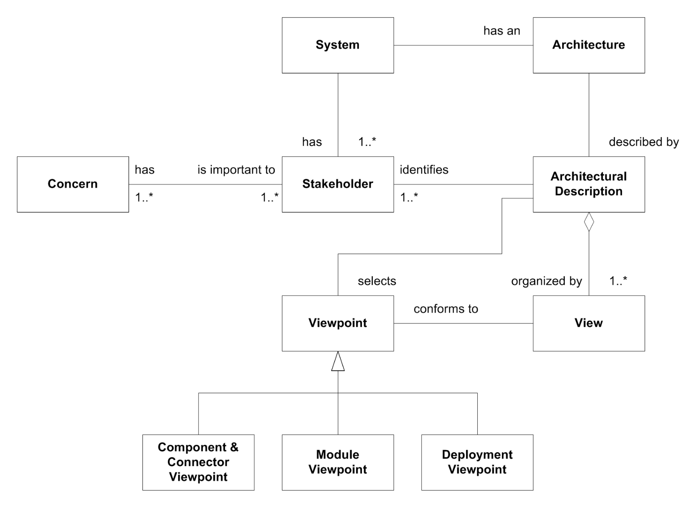
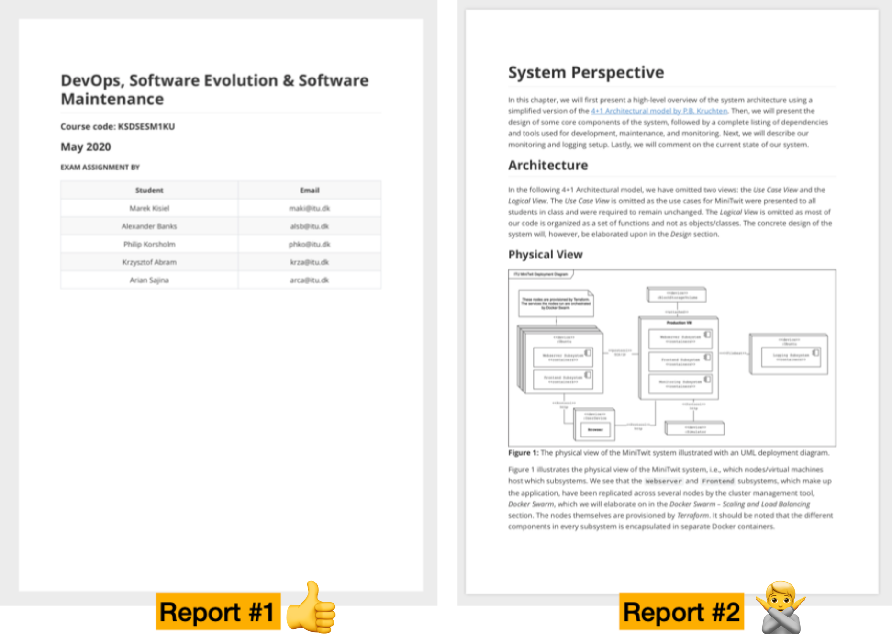
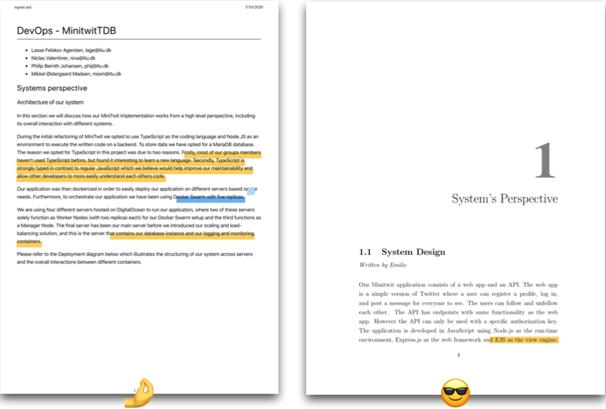
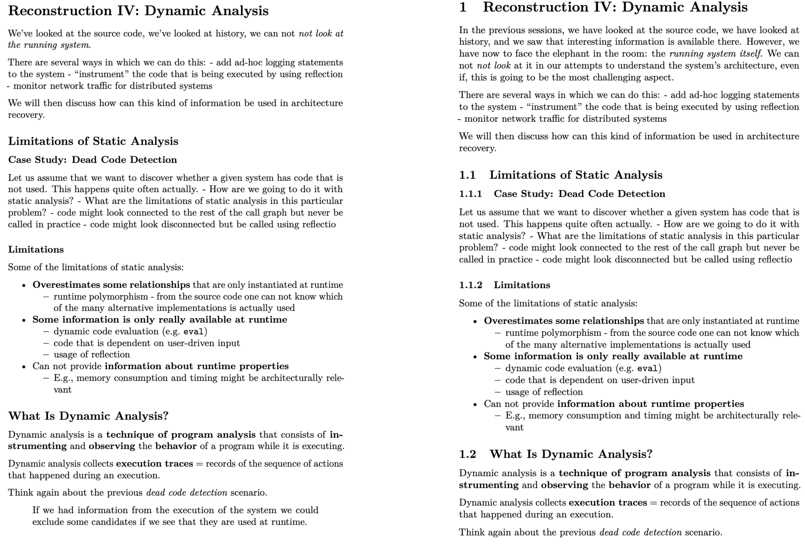
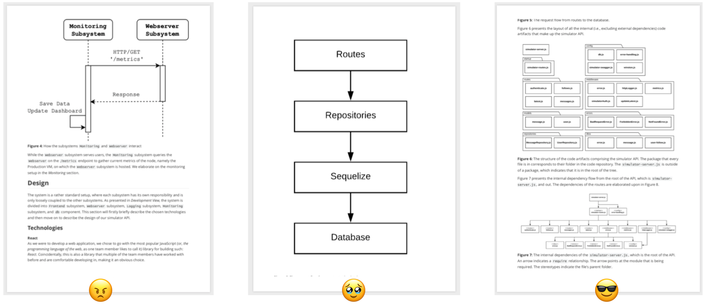

# Documenting a System's Architecture

## One diagram can't describe an architecture — you need multiple viewpoints

A software architecture is too multidimensional to show in a single diagram. 

Different stakeholders care about different things: 
- developers want to know how the code is structured, 
- operations (devops) want to know where it runs, and 
- everyone wants to know how the pieces talk at runtime. 
 
The standard answer is to describe the architecture from **multiple complementary viewpoints**, each answering a different question.

Source: Henrik Bærbak Christensen, et al. [*An Approach to Software Architecture Description Using UML*](https://pure.au.dk/ws/portalfiles/portal/15565758/christensen-corry-marius-2007.pdf)

## Static viewpoints describe structure; the dynamic viewpoint describes runtime behavior

Christensen et al. identify three viewpoints that, taken together, cover most of what you need to document:

**Static views** — how the system is organized when nothing is running:

- **Module viewpoint**: *how functionality maps to static development units* (packages, modules, source files).
- **Allocation viewpoint**: *how software entities are mapped to environmental entities* (which process runs on which machine, where files live, what deploys where).

**Dynamic view** — how the system behaves when it runs:

- **Component & Connector viewpoint**: *the runtime mapping of functionality to components* and how they communicate.

## Each viewpoint has a matching UML notation

You don't have to invent diagrams — UML has a notation that fits each viewpoint:

| Viewpoint               | Type    | UML notation                                                                                                                                          |
| ----------------------- | ------- | ----------------------------------------------------------------------------------------------------------------------------------------------------- |
| Allocation / Deployment | Static  | [Deployment diagrams](https://www.uml-diagrams.org/deployment-diagrams-overview.html)                                                                 |
| Module                  | Static  | [Package](https://www.uml-diagrams.org/package-diagrams-overview.html) and [component](https://www.uml-diagrams.org/component-diagrams.html) diagrams |
| Component & Connector   | Dynamic | (Sub-)system [sequence](https://www.uml-diagrams.org/sequence-diagrams.html) diagrams                                                                 |

## Allocation views use UML deployment diagrams

A deployment diagram shows *where things run*: nodes (physical or virtual machines), artifacts deployed onto them, and the communication paths between nodes.

*Source: [uml-diagrams.org — deployment diagrams overview](https://www.uml-diagrams.org/deployment-diagrams-overview.html)*

*Source: [agilemodeling.com — deployment diagrams](https://agilemodeling.com/style/deploymentDiagram.htm)*

*Source: [uml-diagrams.org — web application clusters](https://www.uml-diagrams.org/web-application-clusters-uml-deployment-diagram-example.html?context=depl-examples)*

## Runtime interactions use UML sequence diagrams. They present the Component & Connector viewpoint

*Source: [Wikipedia — Deployment diagram](https://en.wikipedia.org/wiki/Deployment_diagram)*

Sequence diagrams show *how components talk at runtime*: which actor or service initiates an interaction, which messages are exchanged, and in what order. They're the go-to notation for the **Component & Connector viewpoint**.

*Source: [uml-diagrams.org — sequence diagrams overview](https://www.uml-diagrams.org/sequence-diagrams.html)*

*Source: [uml-diagrams.org — pluck comments example](https://www.uml-diagrams.org/pluck-comments-uml-sequence-diagram-example.html)*

*Source: [uml-diagrams.org — Facebook authentication example](https://www.uml-diagrams.org/facebook-authentication-uml-sequence-diagram-example.html)*

*Source: [uml-diagrams.org — Spring/Hibernate transaction example](https://www.uml-diagrams.org/examples/spring-hibernate-transaction-sequence-diagram-example.html)*

## Processes and pipelines fit naturally into UML activity diagrams

When what you want to document is a *process* — a CI/CD pipeline, an order flow, an incident resolution workflow — **activity diagrams are the right UML** tool.

*Source: [uml-diagrams.org — shopping process order](https://www.uml-diagrams.org/shopping-process-order-uml-activity-diagram-example.html?context=activity-examples)*

*Source: [uml-diagrams.org — resolve issue example](https://www.uml-diagrams.org/software-resolve-issue-uml-activity-diagram-example.html)*

## If you invent your own notation, include a legend

Many DevOps diagrams you find online use custom, tool-specific iconography rather than UML. That's fine — but the moment you drop UML, you owe the reader a legend explaining what each shape and arrow means. A diagram without a legend forces the reader to guess, and guessing is how misunderstandings enter a design review.

*Source: [strategicfocus.com — model training as CI/CD](https://strategicfocus.com/2021/10/06/model-training-as-a-ci-cd-system-part-i/)*

*Source: [CI/CD pipeline on Azure DevOps (Medium)](https://medium.com/@ojijosh2002/ci-cd-pipeline-design-and-build-for-a-banking-application-on-azure-devops-9f068c57fefc)*

# Formatting the Report So It's Actually Readable

## A report starts with a title page that names the title and authors

## Structure the report as numbered sections

Numbered sections let readers and reviewers refer to specific parts unambiguously ("see §3.2"). They also force you to think hierarchically rather than writing one long stream of prose.

Use `--number-sections` with pandoc when converting Markdown to PDF — see the [pandoc manual](https://pandoc.org/MANUAL.html) or this [md_to_pdf.sh example](https://github.com/mircealungu/reconstruction/blob/master/tools/md_to_pdf.sh).

## Figure text should be roughly the same size as body text

The most common readability problem in student reports is screenshots whose text is far smaller (or occasionally larger) than the surrounding prose. A figure the reader has to zoom in on is a figure the reader skips.

Guideline: [Use the Right Font Size in Images](https://github.com/mircealungu/student-projects/blob/master/writing_guidelines/Use_the_Right_Font_Size_in_Images.md).

# To Readterm
- [The Infrastructure as Code Slides](./IaC.pdf)
- [**The Law of Leaky Abstractions**](https://www.joelonsoftware.com/2002/11/11/the-law-of-leaky-abstractions/), by Joel Spolsky
- Henrik Bærbak Christensen, et al. [*An Approach to Software Architecture Description Using UML*](https://pure.au.dk/ws/portalfiles/portal/15565758/christensen-corry-marius-2007.pdf)

# Next Time 

- Guest Lecture - Two of our past students talking about Kubernetes
- More about the Exam with Helge